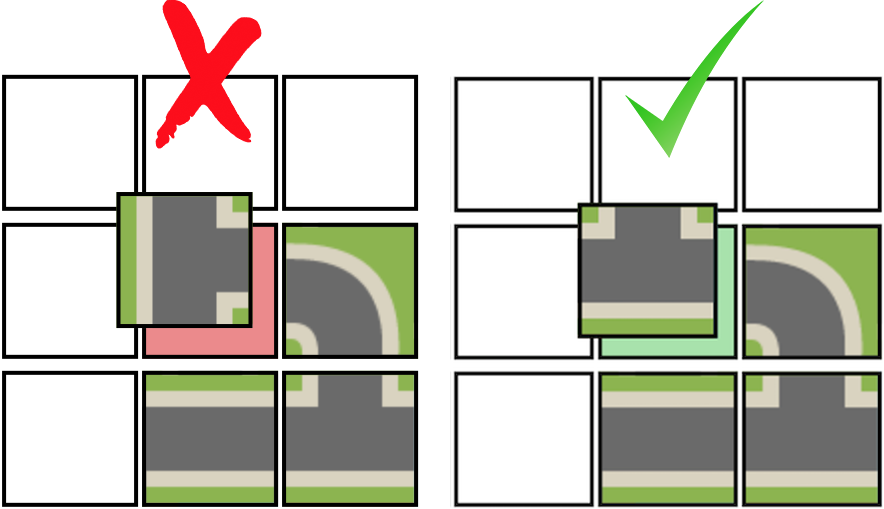
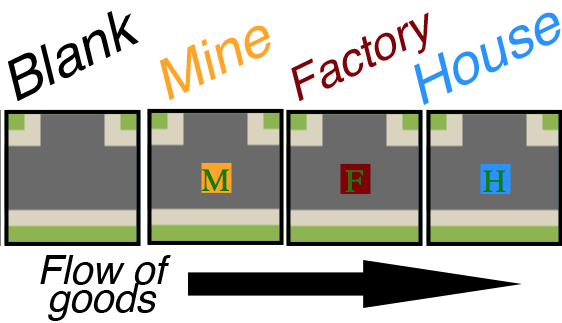
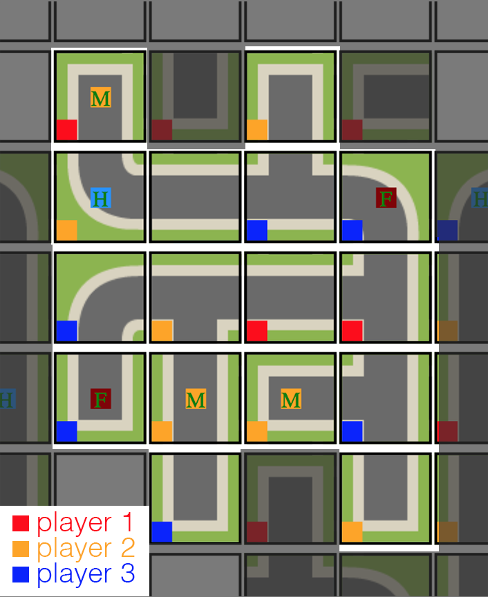
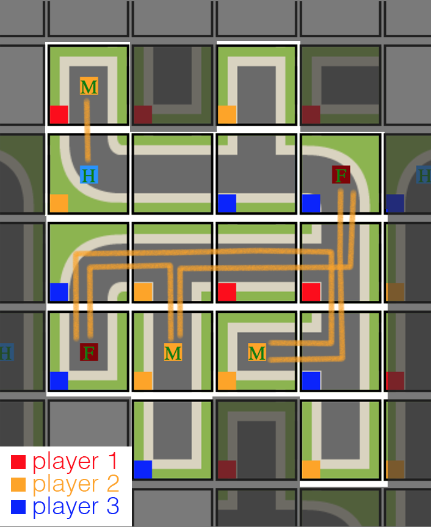

# Using Dijkstra's Algorithm for Score Calculation in a Grid-based Game

Recently, I've been building a multiplayer tile-laying game inspired by games like [Carcassonne](https://en.wikipedia.org/wiki/Carcassonne_(board_game) and [Settlers of Catan](https://en.wikipedia.org/wiki/Catan). I'll soon have some other blog posts about the game and some of the technologies and architectures I'm building it with, but today I'm going to walkthrough and illustrate how I used [Dijkstra's Algorithm](https://en.wikipedia.org/wiki/Dijkstra%27s_algorithm) to implement the scoring component of the game.

### The Game — Rules and Objectives

To begin, I'm going to explain the game, so as to motivate why I even needed a pathfinding algorithm in the first place. If all you want to see is my implementation, feel free to skip to the [next section]((#implementation-in-javascript)).

Like Carcassonne, the game begins with a single tile on the board. When it is each players' turn, they draw a random tile and must place it somewhere on the board. In order to place the tile, all of its edges must match with those surrounding it. Streets have to match up to streets, and grass has to match up with grass. Tiles can be rotated but not swapped out. So what a player will do on their turn is largely dependent on what tile they draw.






Tiles can either be a simple road tiles which are used to connect other tiles, or they can be *special tiles* which includes one of three game pieces on them: a mine, a factory, or a house. The basic logic of the game is as follows: **Mines provide factories with materials, factories turn these materials into goods, which they then ship to houses for consumption.**

Players *own* the tiles that they place, including any special tiles. This is indicated (at least right now in this mock-up stage) by little badges with the player's color on the bottom left of the placed tile. (See next image for example.) Players receive points based on the tiles tha they own on a path when the game is scored.

A path is scored whenever it gets *completed*, meaning that there is no possibility for other tiles to be added to it: it becomes a closed system. When this happens, a scoring event takes place which calculates the value of each tile on the path, and then awards each player points accordingly.

After several turns of placing tiles, a path eventually becomes complete:



The scoring event then takes place for this path, assigning values to each tile according to the following rules:

* Each tile on a completed path is automatically worth **1pt**.
* Each mine *which is connected to a factory* is worth a number of points equal to the distance between it and the factories that it supplies. A mine which is not connected to at least one factory is worth the default 1pt.
* Each factory *which is supplied by a mine **and** which is connected to a house* is worth a number of points equal to the distance between it and the houses that it supplies **multipled by 2**.

It is in calculating the values of the connections between the mine, factory, and house tiles that the Dijkstra Algorithm is used. Before we finally get to the code and implementation details, however, let's look at what we want to happen. The following image shows the attempted paths from each mine.



Player 2, yellow, owns two mines, and each mine has a free path to each of the two factories owned by blue. Good for yellow! The mine on the right has two valid paths, one of length ``3`` and one of length ``6``, meaning that the total amount of points for this mine is `` 1 + 3 + 6 = 10``. A pretty nice bonus. Similarly, player 2's mine of the left also has two valid paths to factories, one of length ``3`` and one of length ``4``, for a total for this mine of ``1 + 3 + 4 = 8``


The following image shows the path between one mine and one factory, as well as the path between the factory and one house:

Let's walk through step-by-step what we want the


### The Code — Implementation in Javascript

```javascript
calcCompletedPathScore: function(path) {
  // calculates the value of a completed path
  // for the various players
  if (this.debug) console.log("Calculating Path Score...", path);
  ...
```

###### Inspiration and Resources:
*  https://en.wikipedia.org/wiki/Dijkstra%27s_algorithm
* https://hackernoon.com/how-to-implement-dijkstras-algorithm-in-javascript-abdfd1702d04
* https://en.wikipedia.org/wiki/Maze_solving_algorithm
